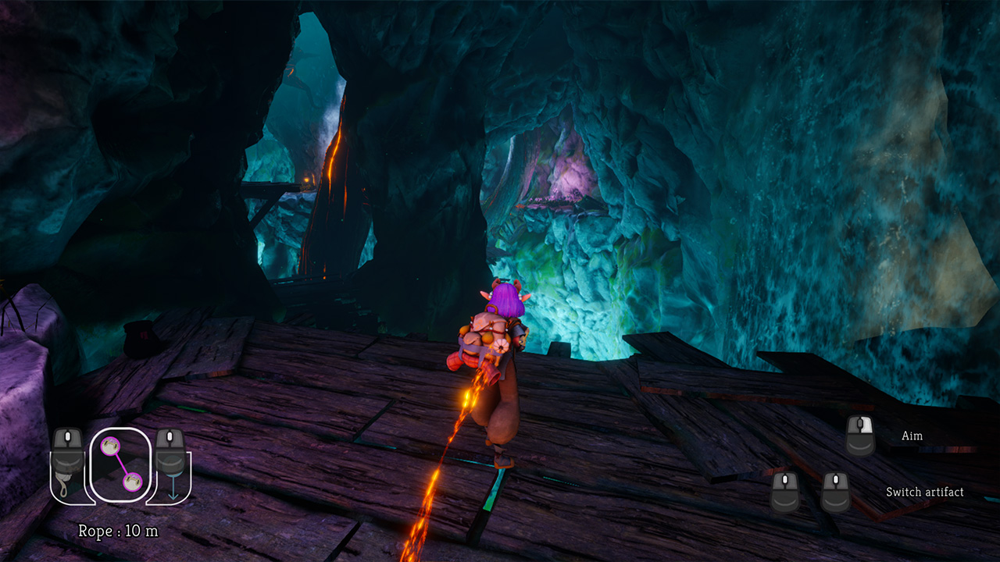
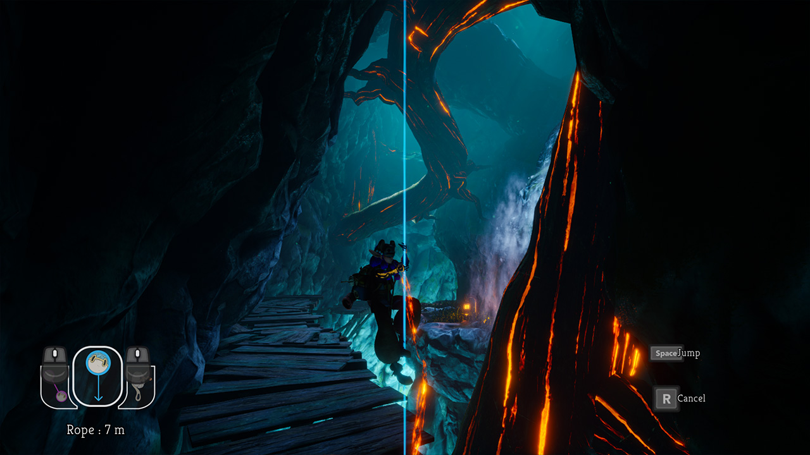
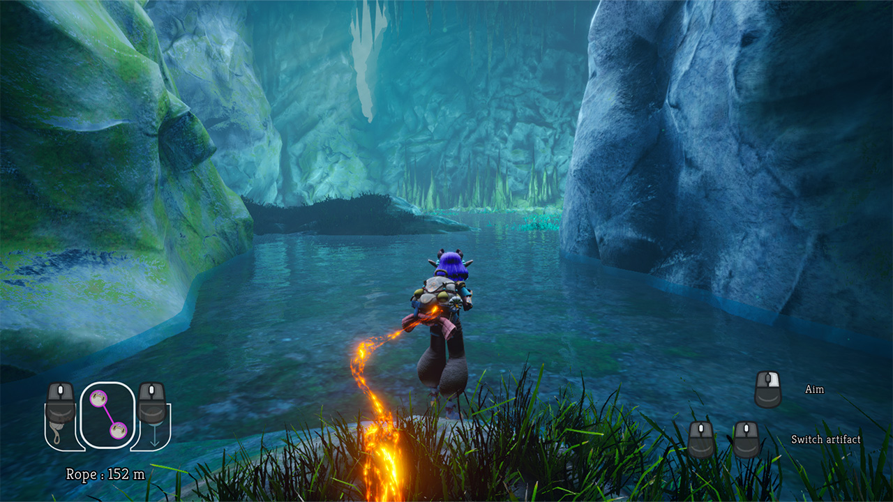

<h1 align="center">  Earwyrm </h1>

  
  
  

<h2> 🎮 Itch.io Page https://theymakesounds.itch.io/they-make-sounds  </h2>

[📄 Document that detailed our project's risk for movement based artifacts](./RiskDocumentation.pdf)

They Make Sounds is a 3D exploration game where you play an archaeologist descending from the gigantic abyss to study the ruins of a mysterious civilization. 
Equipped with ancient artifacts, make your way even deeper into the abyss to unravel the secrets of this mysterious civilization and discover how their story relates to yours.
  
Here is how I contributed to the project :

- 🎮 Gameplay Programming :  
I worked on traversal mechanics, including the zipline and vertical rope, implementing both the aiming and creation systems, as well as the physical movement of using them.
To ensure smooth and responsive movement, I developed tools that allowed us to fine-tune traversal metrics.
Additionally, I contributed to the rock-throwing mechanic and integrated our player’s animations.

- 🖥️ UI Programming :  
I implemented the game’s HUD and developed various accessibility and quality-of-life settings, such as control remapping, toggle options for hold vs. click interactions, video options, and more !

- 🦻 Accessibility Features :  
To make our game more inclusive, I implemented closed caption subtitles that are spatialized based on the direction of the sound source.
Additionally, I created an icon-based system and control reminders to further assist players in navigating the game.

  

